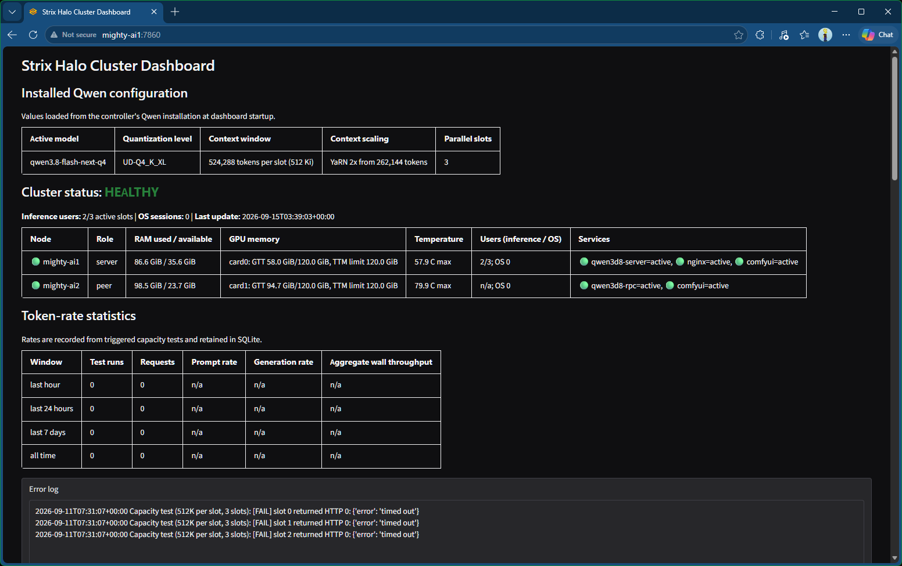
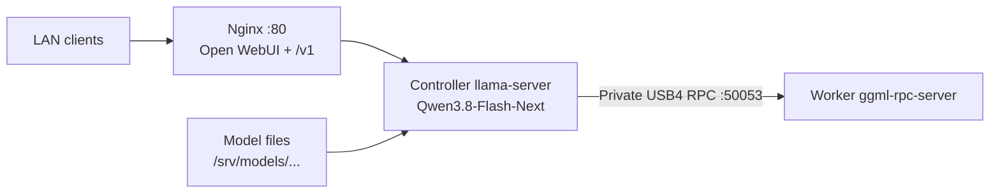
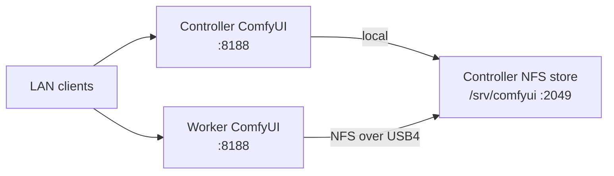

# Strix Halo Cluster

Yet another setup process for a two-PC AMD Strix Halo cluster.

This instance uses two 128 GB AMD Strix Halo PCs (Bosgame M5 nodes) linked over USB4 as a private AI cluster hosting Qwen3.8-Flash-Next for up to three concurrent inference slots. ComfyUI and a system monitoring dashboard can also be installed.

## Features

- Turnkey scripts. Start with a fresh Ubuntu install and the scripts handle all the rest.
- The tested Bosgame M5 nodes are linked over USB4. The verifier targets at least 8 Gbit/s over the private link. A USB4 data cable is required. I use https://link.amazon/B03prmZHS
- Qwen3.8-Flash-Next supports the Q4, Q5, and Q6 quantization presets and different context window sizes. To host up to three concurrent inference sessions, I use Q4 with 512 Ki tokens per slot.
- ComfyUI is set up on both nodes. Each node runs its own ComfyUI instance, and both use a shared model/data store so models only need to be downloaded once for use on either node.
- Both nodes provide remote desktop services and each exposes an anonymous, read/write `xfer` folder on the network for maintenance from Windows clients.
- Qwen3.8-Flash-Next sessions served by the cluster have been tested from Windows clients using Open WebUI in a web browser, [AnythingLLM](https://anythingllm.com/) on the desktop, VS Code [extensions](https://marketplace.visualstudio.com/items?itemName=AndrewButson.github-copilot-llm-gateway), and custom tools using the Copilot SDK.

### Caveats

This is all configured for a trusted, private LAN environment. No security measures are taken beyond basic firewall settings and disabling Wi-Fi/Bluetooth radios. This is not a configuration to expose to the internet or public networks.

The XFCE desktop installed for Ubuntu is bare-bones and ugly, but uses very little GPU and memory. I chose this to keep as many resources free for the AI models as possible.

### Sample Dashboard


## Architecture

### LLM inference



The controller serves the LAN API and coordinates inference; the worker provides remote GPU layers over `usb4llm0` (`10.200.0.0/30`).

### ComfyUI and shared storage



Both nodes run ComfyUI. The controller owns the shared store and exports it to the worker over the private link. Samba file transfer and XRDP run on each node but are omitted from these focused diagrams.

## Requirements

- Ubuntu 26.04.1 or later is the tested baseline on both nodes. The installers require `apt-get` and `systemd`.
- Two nodes connected by USB4 and reachable by their LAN hostnames
- An unprivileged Linux account on each node; use matching UID/GID values for the shared ComfyUI store
- Sufficient local storage for the selected model and, if enabled, the optional peer RPC cache
- A trusted LAN: the default Samba share is anonymous and read/write

The installer planning estimates are 110 GiB for Q4, 150 GiB for Q5, and 160 GiB for Q6. For a fresh download, allow roughly 129 GiB, 173 GiB, and 183 GiB of free space respectively because the installer reserves 25 GiB during download. The peer RPC disk cache is disabled by default because its upstream implementation has no size limit; enable it only when the cache is on storage with an explicit retention or quota policy. Q5 and Q6 are experimental on this two-node topology. If Hugging Face authentication is required, set `HF_TOKEN` and preserve it through `sudo`, for example: `sudo --preserve-env=HF_TOKEN bash setup-qwen3d8.sh ...`.

## Quick start

Copy all scripts to the Ubuntu machines and run. Replace the placeholders and use the same Linux account and quantization on both nodes. Remember, reboots may be required before services are active. If you monitor with the included dashboard you'll see it may take a few minutes for the cluster to report itself as 'Healthy'. Some of the services need time to connect and establish their links. 

For these scripts, one machine is the 'server' and the other is the 'peer'. The server is the box your users will connect to.
Copy the same scripts to both machines, but be sure to run them with the correct parameters on each machine.
Some scripts have more options if you want to customize the setup further.

```bash
# 1. Base environment: run on both nodes. Must be done first.
# Run on the server first, then the peer using the proper --role settings for each
sudo bash setup-environment.sh --role server --user <linux-user>  # server
sudo bash setup-environment.sh --role peer --user <linux-user>    # peer

# 2. After reboot you can verify both nodes (be sure USB4 cable is connected)
sudo bash verify-environment.sh  # server
sudo bash verify-environment.sh  # peer

# 3. Distributed Qwen3.8: run on the server first, then the peer using the proper --role settings for each
sudo bash setup-qwen3d8.sh --role server --user <linux-user> --quant Q4 --context 256 --skip-foundation # server
sudo bash setup-qwen3d8.sh --role peer --user <linux-user> --quant Q4 --context 256 --skip-foundation   # peer

# 4. Optional ComfyUI: run on the server first, then the peer using the proper --role settings for each
sudo bash setup-comfyui.sh --server <controller-host> --peer <worker-host> --role server --user <linux-user>    # server
sudo bash setup-comfyui.sh --server <controller-host> --peer <worker-host> --role peer --user <linux-user>      # peer

# 5. Optional dashboard: run on the server first, then the peer using the proper --role settings for each
sudo bash dashboard/setup-dashboard.sh --role server --dashboard-host 0.0.0.0   # server
sudo bash dashboard/setup-dashboard.sh --role peer  # peer
```

The controller downloads the model and serves the API; the worker provides the USB4 RPC service. If you skip the preliminary environment step, omit `--skip-foundation` from `setup-qwen3d8.sh` and let that script run it.

For three Q4 slots with an extended 512 Ki-token-per-slot context, replace
`--context 256` with `--context 512` in both Qwen setup commands. The
installer automatically configures 2x YaRN scaling and the required temporary
GGUF metadata override; run the capacity test and long-context quality checks
before using the extended window in production.

## Scripts

| Script | Purpose |
| --- | --- |
| `setup-environment.sh` | Base node setup: USB4, Samba file drop, XRDP, SSH, and UFW |
| `setup-comfyui.sh` | ComfyUI on each node with an NFS-shared model/data store |
| `setup-qwen3d8.sh` | ROCm, `llama.cpp`, Qwen3.8 model, RPC services, and controller web UI |
| `verify-environment.sh` | Checks services, networking, firewall rules, and USB4 throughput |
| `dashboard/` | Independent telemetry agent, Python test runner, Gradio dashboard, and dashboard-only installer |

## Services and defaults

- USB4: `usb4llm0`, controller `10.200.0.1`, worker `10.200.0.2`
- RPC worker: private TCP port `50053`
- Qwen3.8: Q4, three parallel inference slots, 192 Ki tokens per slot by default; use `--context 256` for the native 256 Ki tokens per slot, or `--context 512` for Q4 with automatic 2x YaRN scaling
- Open WebUI and OpenAI-compatible API: `http://<controller>/` and `http://<controller>:80/v1/`
- Cluster dashboard: `http://<controller>:7860` after installing `dashboard/setup-dashboard.sh`
- ComfyUI: `http://<node>:8188`
- Windows file drop: `\\<node>\xfer`; XRDP: `<node>:3389`
- XRDP redirected Windows drives: `~/thinclient_drives` inside the remote session
- SSH: `<node>:22` (OpenSSH server, installed and enabled by `setup-environment.sh`)

All scripts are designed to be rerun safely. Use `--help` for the complete option list, review any `Action required` messages, and use `sudo qwen3d8-status` or `sudo usb4-cluster-status` for diagnostics.

The dashboard is maintained separately from the provisioning scripts. See
[`dashboard/README.md`](dashboard/README.md) for its installation, telemetry
agent, configurable capacity tests, persistent token-rate statistics,
command-line tests, and Gradio controls.

The Qwen installer installs both the GPU-targeted ROCm runtime and the matching
ROCm core development package. The latter supplies HIP's CMake package, which
is required to build llama.cpp; installing only the runtime package is
insufficient.

## Windows file transfer through XRDP

XRDP supports Windows drive redirection and clipboard transfer through its
`xrdp-chansrv` channel server. Xorg provides the remote display and Xfce
provides the desktop. FUSE is used for redirected-drive mounts, not clipboard
transfer. The installer enables the `rdpdr` and `cliprdr` channels, installs
FUSE, and mounts selected Windows drives under `~/thinclient_drives`.

With the built-in Windows client (`mstsc.exe`):

1. Select **Show Options** before connecting.
2. On **Local Resources**, leave **Clipboard** selected.
3. Select **More...**, expand **Drives**, and select the Windows drives to share.
4. Connect using the configured Linux account.
5. In the Xfce file manager, open **Home** and then `thinclient_drives`. The
   selected drives appear there, usually as `C on <Windows-PC>` and similar.

Drive redirection must be selected before the RDP session starts. Direct
drag-and-drop from a local Windows Explorer window onto an Xfce window is not
provided by XRDP; use the redirected drive or copy/paste between file-manager
windows. If the drives are not visible, disconnect and reconnect after
selecting them, then check `sudo bash verify-environment.sh --skip-throughput`
and the per-session `xrdp-chansrv` log under `~/.local/share/xrdp/`.

The SMB maintenance share remains available as a simpler fallback:
`\\<node>\xfer`. It does not depend on an active XRDP session and is useful
when Windows policy disables RDP drive redirection.

## Concurrent physical and XRDP logins

On Ubuntu systems using `dbus-user-session`, same-user physical-console and
XRDP sessions can conflict because they may share D-Bus session state. A user
logged in at the physical console can therefore see a black screen or a failed
XRDP login when the same account is used remotely.

The default installer session is XFCE. It starts the XRDP XFCE session with
its own D-Bus bus by clearing `DBUS_SESSION_BUS_ADDRESS` before launching
`dbus-launch`, while preserving `XDG_RUNTIME_DIR` for `systemd --user`,
terminals, and desktop applications. This allows a best-effort separate local
and remote session without sharing the physical desktop. Rerun
`setup-environment.sh` on each node and reconnect after applying the change.

These are separate desktops: XRDP does not attach to or mirror the physical
console session. Some applications and `systemctl --user` services still
assume one graphical session. GNOME is not a reliable choice for this
arrangement; use the managed XFCE session or a separate Linux account for
reliable maintenance access. Pass `--no-concurrent-local` to retain the
standard single-session behavior.

---

> If you enjoy this project, please consider:

<a href="https://www.buymeacoffee.com/mighty_studios" target="_blank">
  
</a>

<small>(The joy I get from a free latte is incredible)</small> 